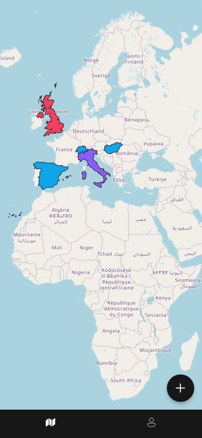
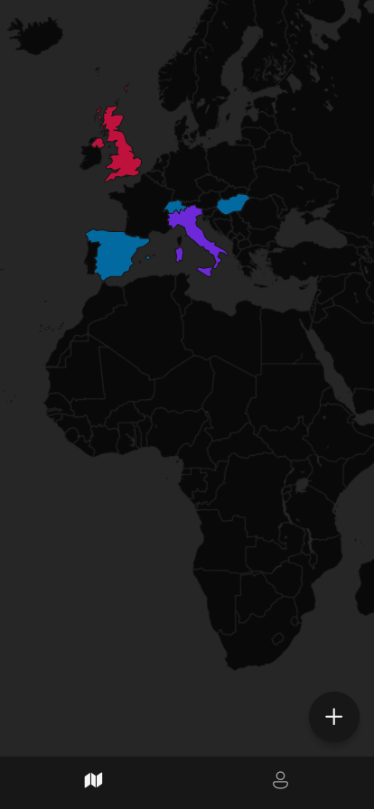
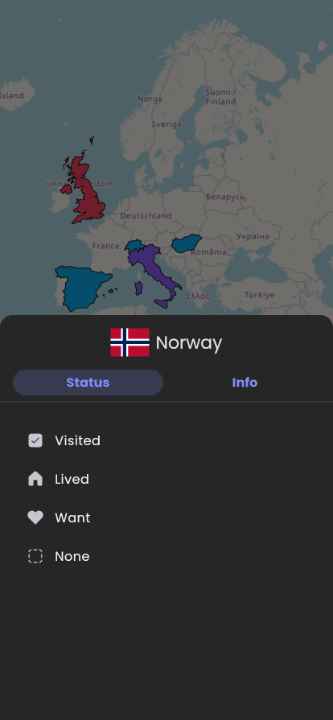
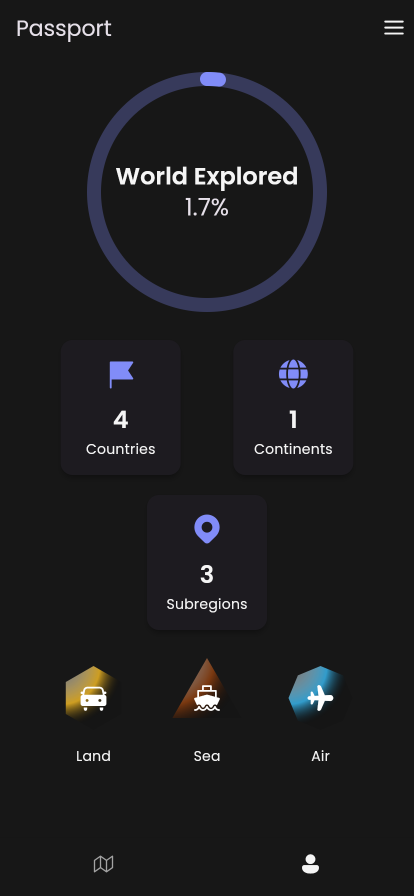

# 🌍 Yourworld

**Yourworld** is an intuitive mobile app that lets you track your travels around the world.

## ✈️ Features

- 📍 **Quick check-ins** — Mark places you've visited with just two taps
- 🗺️ **Interactive world map** — See your travel history come to life
- 🎨 **Customizable themes** — Choose from multiple beautiful map styles
- 📊 **Travel insights** — View stats like countries and continents visited
- 🔒 **Privacy-focused** — Your data stays on your device, always

## 📷 Screenshots

<p align="left">
  
  
  
  
</p>

## 🚀 Getting Started

### 📱 Run the app

Clone the repository and launch the app with Flutter:

```bash
git clone https://github.com/ChristianAlessandri/yourworld.git
cd yourworld
flutter pub get
flutter run
```

Or download the latest `.apk` from the [Releases](https://github.com/ChristianAlessandri/yourworld/releases) section.

## 📄 License

This project is licensed under the **GNU GPLv3**. See the [LICENSE](LICENSE) file for details.

## 📦 Changelog

View the [Changelog](CHANGELOG.md)

## 🙋‍♂️ Author

Made with ❤️ by @ChristianAlessandri
